### 参考示例图 ###
#### 原始户型 ####
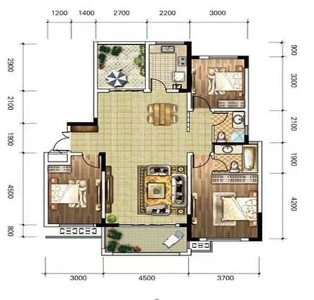  
#### 1.地板颜色、顶部灯带 ####
客厅的地板可以用灰色，或原木色  
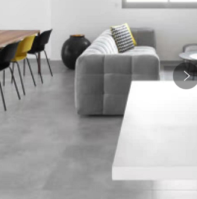  
  
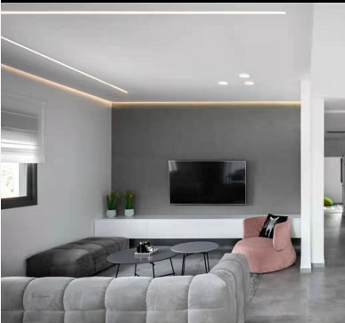

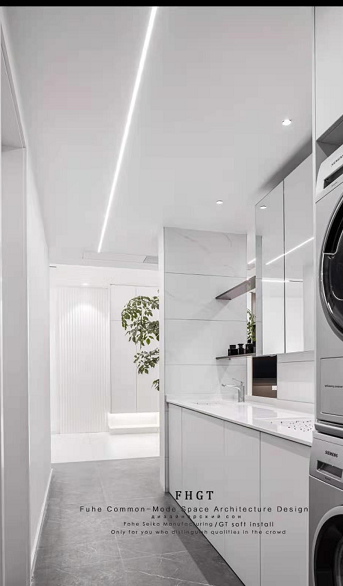  

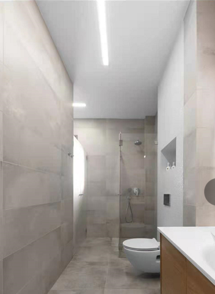  

#### 2.无把手的柜子 ####
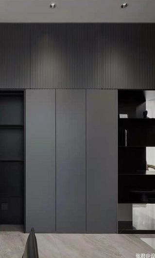  
  
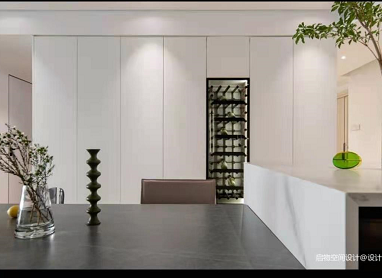

#### 3.白色过多时，可以在墙面上刷部分灰色漆 ####

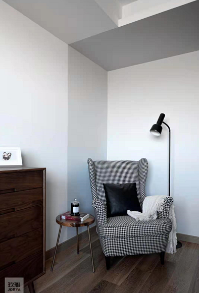  

#### 4.厨房柜面一体，顶部的平面灯，玻璃门用大玻璃窄边框 ####
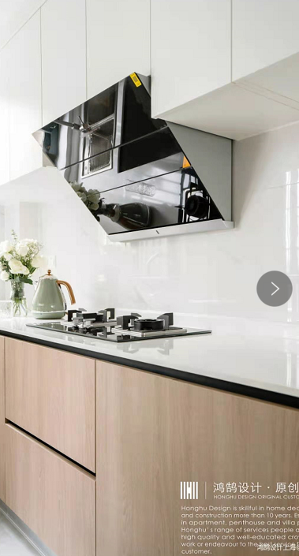  
  
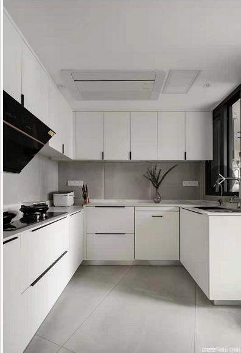

  

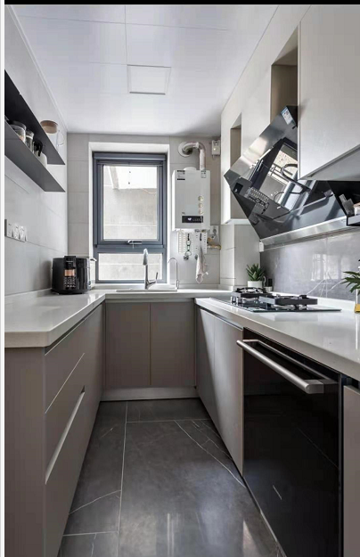  

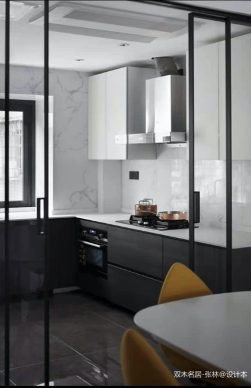 

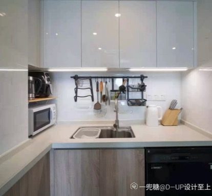 

#### 柜门平整无把手 ####
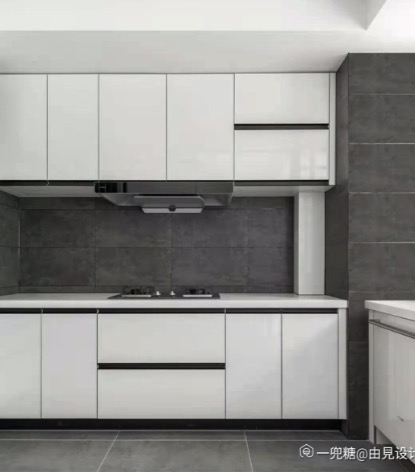 
#### 内嵌烤箱洗碗机 ####
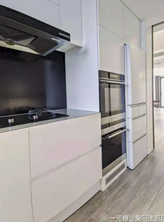 
#### 5.扁平的吊灯 ####
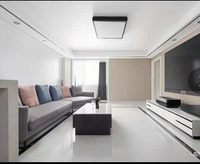 

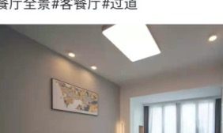 

#### 6.洗漱台，下面悬空，我们可用原木色柜面。壁挂式马桶。大型镜子分三块，就不显得空大 ####
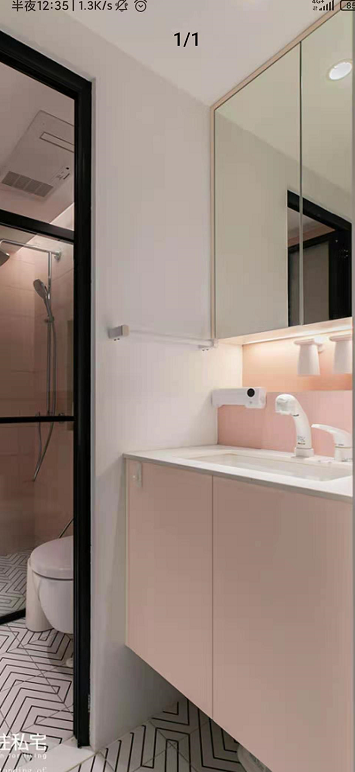   

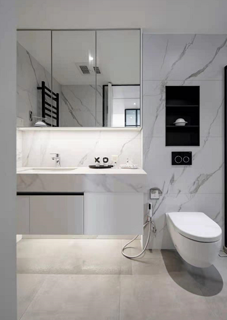 
#### 镜柜也不错 ####
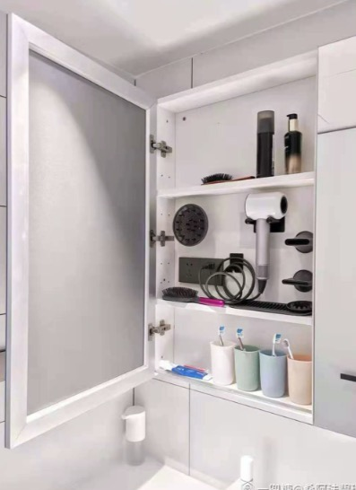 
#### 门后墙上挂卫生工具 ####
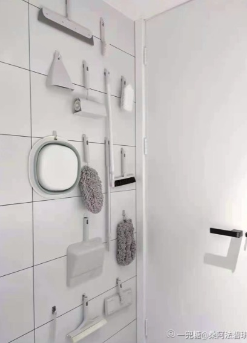 

#### 7.隐藏门和墙面融合 ####
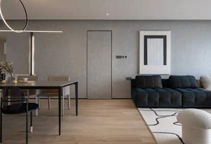   

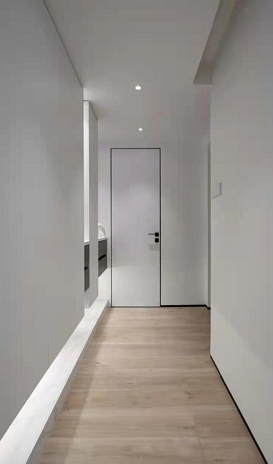 

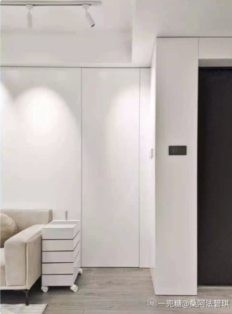 
#### 8.客厅布置，沙发墙的板面，电视柜 ####
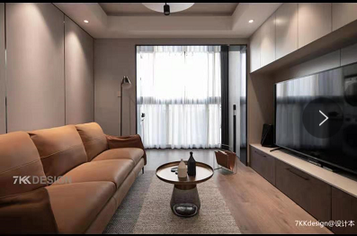 
#### 弧形护墙板####
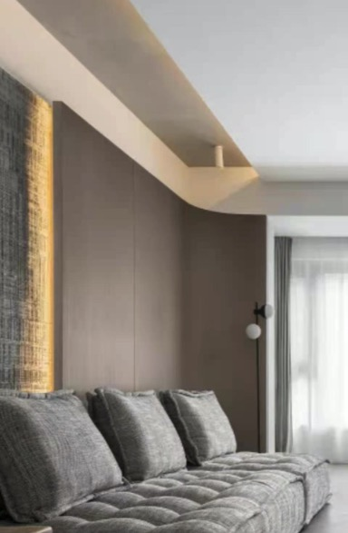 
#### 9.卧室的护墙板，无靠背大床 ####
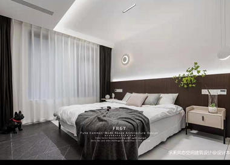 
####床头灯####
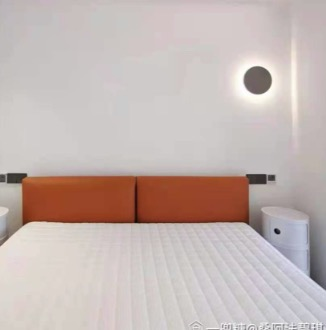 
####10.洗衣机、烘干机、旁边盥洗台 ####
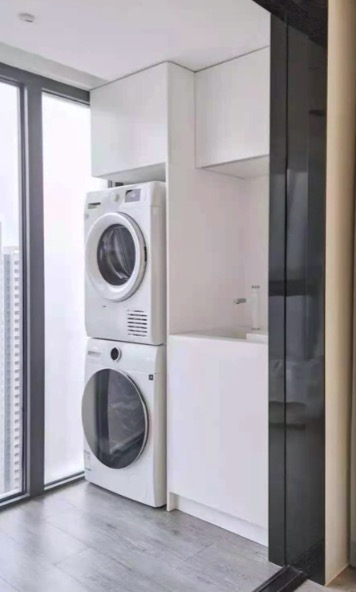 
#### 11.扁平的土拨鼠地吸 ####
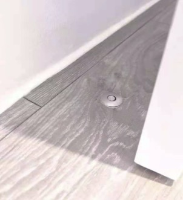 

#### 12.画龙点睛的暖色抱枕 ####
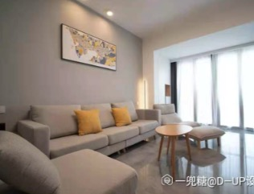 